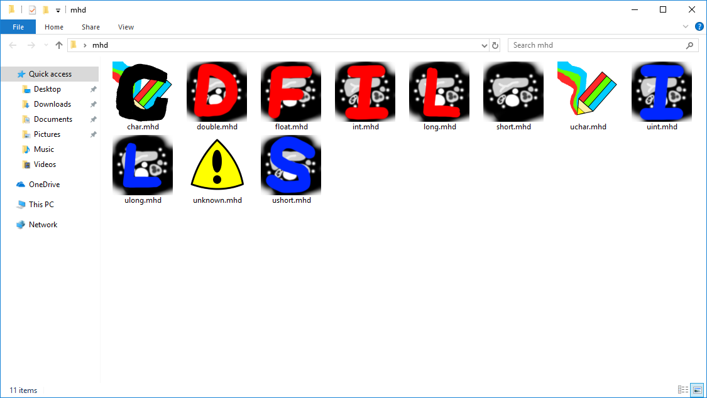
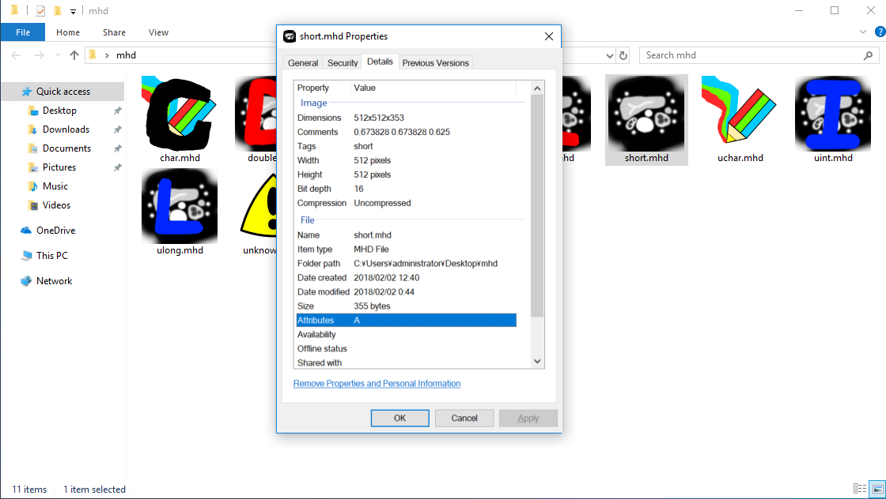
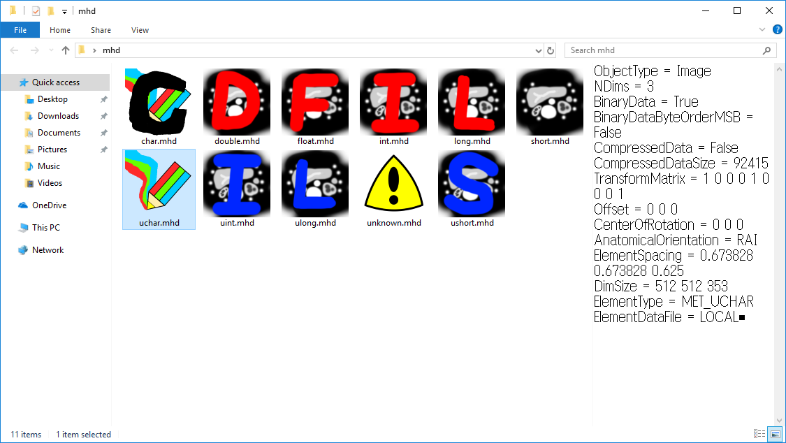
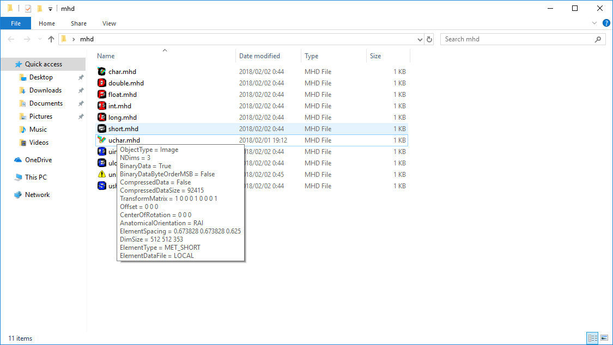

# MHD Shell Extensions #
Shell extensions for mhd/mha image data.

## Screenshots ##
|Icon|Properties|
|---|---|
|||

|Preview|Infotip|
|---|---|
|||

## Install ##
* Move dll's and scripts to a permanent location (i.e. You can't relocate dll's after the installation)
* Open command prompt as admin
* Execute `backup_registry.bat`
* Execute `regsvr32 <dll_you_want_to_install>` to install one dll or `register.bat` to install all dll's
* Execute `set_property.reg` (required only for MHDPropertyStore)

### Custom icons overridden with application icons ###
* Execute `delete_userchoice.reg` to delete user's association
* Edit associate.reg
* Execute `associate.reg`

## Uninstall ##
* In admin command prompt `unregister.bat`
* ~~Delete some registry keys in case you need to :D~~
* Revert registry changes using backups.
 
## TOODs ##
* [] Unit test
* [X] NRRD format (.nrrd) (icon handler only)
* [ ] Analyze format (.hdr)

## References ##
* [Shell extension examples](http://eternalwindows.jp/shell/shellex/shellex00.html)
* [Documentation](https://msdn.microsoft.com/library/windows/desktop/cc144067(v=vs.85).aspx)
* [Preview handler example](https://code.msdn.microsoft.com/windowsapps/CppShellExtPreviewHandler-58db53b8)
* [Icon handler example](https://www.codeproject.com/Articles/797/The-Complete-Idiot-s-Guide-to-Writing-Shell-Extens)
* [File association](https://www.glamenv-septzen.net/view/14)
* [File association](https://www.ipentec.com/document/windows-not-recovery-icon-in-extension-disassociation)

## dev note ##
Update dll
1. unregister.bat
2. close all the explorer windows
3. restart explorer in the task manager
4. register.bat
5. do step 3 again